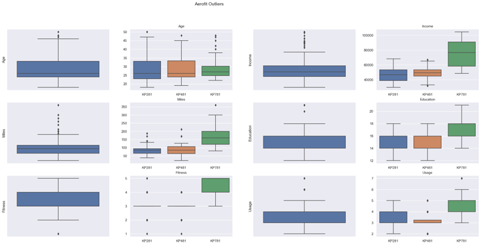

### Q1. What is the probability of a male customer buying a KP781 Treadmill?
| Product | KP281 |KP481|KP781|
|---------|-------|-----|-----|
| **Gender** |
|Female | 52.631579 | 38.157895 | 9.210526 |
|Male	| 38.461538	| 29.807692	| 31.730769| 
|All	| 44.444444	| 33.333333	| 22.222222|
Insight
*  Probability of a Male customer buying **`KP781`** is 31.73%

### Q2. What is the total count of each product present in the dataset?
| Product | KP281 |KP481|KP781|
|---------|-------|-----|-----|
|count	| 80.0	| 60.0	| 40.0|
|P-Val	| 44.44%| 33.33%| 22.22%|
Insight
*   KP281 have count **80** with 44.44% probability.
*	KP481 have count **60** with 33.33% probability.
*	KP781 have count **40** with 22.22% probability.

### Q3. Describe the Age & Gender distribution of all the customers?
###### Insight
|Gender	|count |mean |std |min |25%	|50% |75% |max|
|---|---|---|---|---|---|---|---|---|
|Female	|76.0	|28.565789	|6.342104 |19.0	|24.00	|26.5	|33.0	|50.0|
|Male	|104.0	|28.951923	|7.377978 |18.0	|23.75	|26.0	|34.0	|48.0|

|Gender	|Age|
|---|---|
|Female	|28.565789|	
|Male	|28.951923|	

* Using **T-Test**, Probability of Male age higher than Female age have a p-Vale of 35.679%.
* There is a small difference between mean Age of Male & Female.
* When following 95% Confidence Interval. So, we failed to prove that Male age are Higher than Female Age. among Customers.

### Q4. Top 3 features having the highest correlations with the Product column. and why?
###### Insight

* Product Have higher co-relation with **Income**, **Fitness** & **Miles**.
  * For **KP781** we have observed same co-relation.
  * But, for **KP481** Top 3 co-relation are `Age`, `Education` & `Income`.
  * But, for **KP281** Top 3 co-relation are `Age`, `Education` & `Usage`.
* As, we know **KP781** is the expansive & better one, mostly preferred by Athletes or Fitness enthusiast, who’s also have higher Income.
* But, for **KP481**, **KP281** people with good Education, who are health conscious, want to have a Treadmill but can't afford an expansive one. customers.

### Q5. Top 3 features having the highest correlations with the Product column. and why?
###### Insight

Age : (0, 5) 
Income : (0, 19) 
Miles : (0, 13) 
Education : (0, 4) 
Fitness : (2, 0) 
Usage : (0, 9)

*	When, we remove these outliers it might effect credibility of `Product` specific analysis. Because Some of the product dependent on the data.
